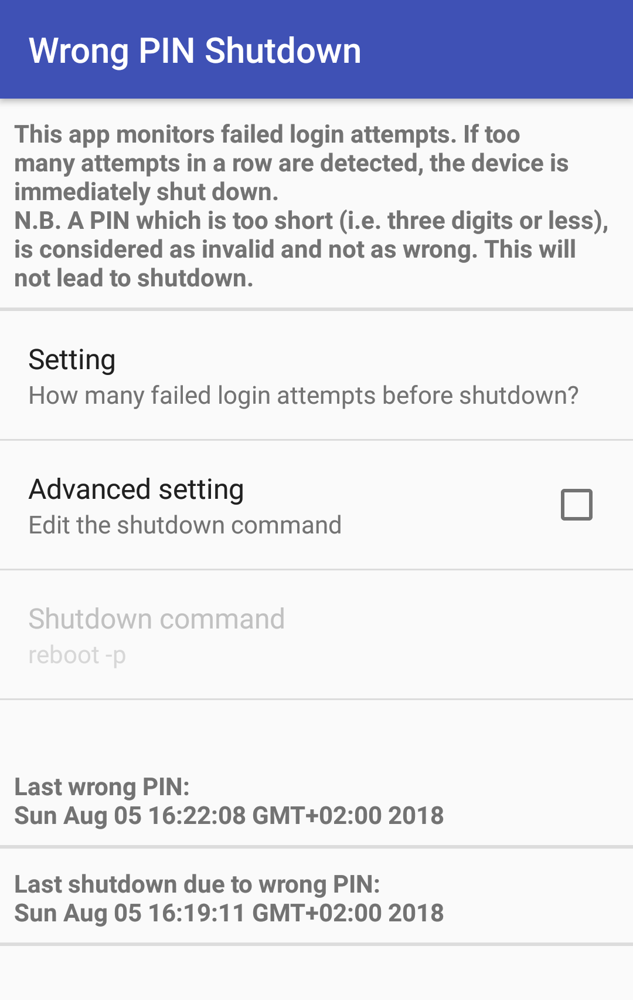

# Wrong PIN Shutdown

This simple app monitors the number of failed login attempts.
If a certain number of attempts is exceeded, the device is automatically shut down.

This app only works on a **rooted** device.
You have to grant the app permanent superuser privileges and register it as a device administrator.
These steps are automatically initiated on the first startup.

